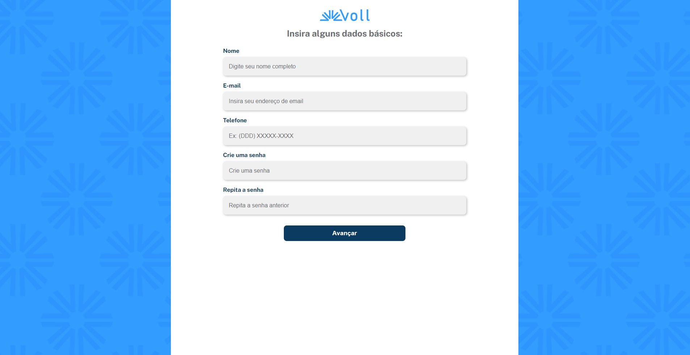

# Voll Med

Este é um projeto desenvolvido no curso *Validando formulários com React Hook Form* da [Alura](https://cursos.alura.com.br/).

>[!TIP]
>[Repositório do curso](https://github.com/alura-cursos/3652-react-forms)

## Tecnologias utilizadas

- [React](https://react.dev)
- [TypeScript](https://www.typescriptlang.org/)
- [Styled Components](https://styled-components.com/)
- [React Hook Form](https://react-hook-form.com/)

## Como acessar online

O deploy do projeto foi feito pelo [Netilify](https://www.netlify.com/) e está disponível em https://ola-mundo-alura.netlify.app/

O deploy do projeto foi feito pela [Vercel](https://vercel.com/) e está disponível em https://cinetag-renansantos7.vercel.app/

## Como rodar localmente

Este projeto foi criado usando [Vite](https://vite.dev), portanto você pode seguir a documentação desse script para fazer deploy do site localmente.

No caso, primeiro você precisará baixar o projeto com executando o seguinte comando no terminal:

```
git clone https://github.com/RenanSantos7/ola-mundo-react-router.git
```

Agora, instale as dependências:

```
npm i
```

E por fim rode o projeto com:

```
npm run dev
```

O terminal mostrará o endereço para acessar o site no qual você pode clicar para abri-lo. Você também pode apertar `o` e depois `Enter` para fazer isso.

## Licensa

O projeto está disponível publicamente com a licença [MIT](./LICENSE)